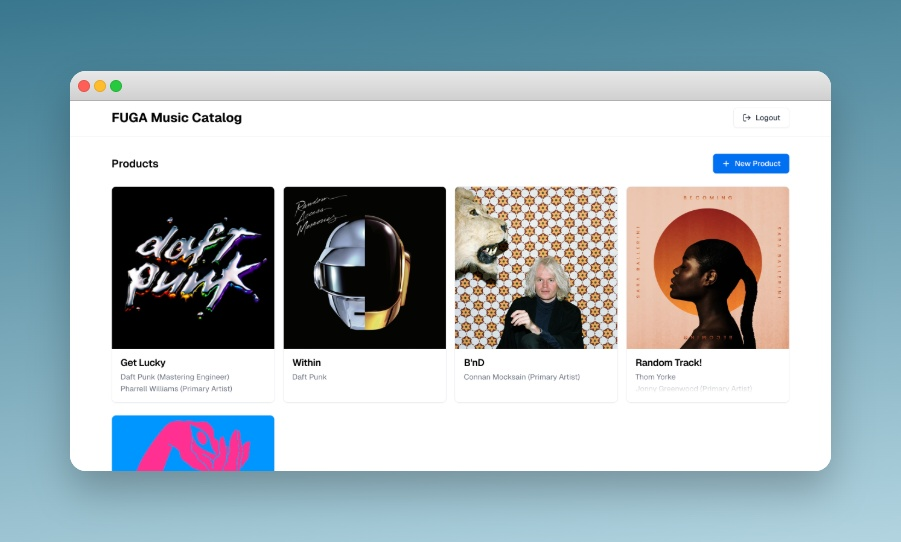

# Assignment for FUGA — Music Product Catalog Management

  

 Hey FUGA team! ⭐ really excited to share this with you, and even more excited about the chance to join you and work on real FUGA projects.

I approached this assignment exactly as I would approach a real feature at scale. I started with a [Product Requirements Document](./docs/29-11-2025_PRD_music-catalog-management.md) to frame the scenario, clarify constraints, and explicitly define scope cuts. From there, I wrote an [Architectural Decision Record](./docs/29-11-2025_ADR_basic-architecture-and-tech-stack.md) to justify the stack and system structure. after that, I moved into implementation.

If you want the full picture, I recommend going through the docs first. they explain the reasoning, the design and decisions, also the tradeoffs.. and then diving into the code. 

to run this project locally check out the [Setup Guide](./SETUP.md).

You can also try the deployed version of the app at [https://fuga-catalogweb-production.up.railway.app](https://fuga-catalogweb-production.up.railway.app).

Time spent
- Fri: docs + design
- Sat: coding
- Sun: coding
- Mon: wrap-up + submission

Total: ~20 hours

Best! Alireza
