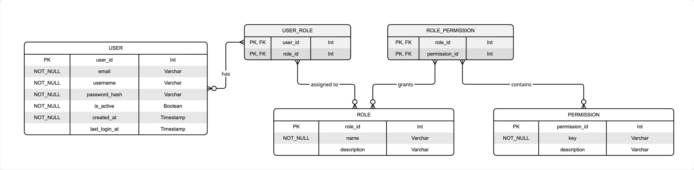

# [ADR] Basic Architecture and Tech Stack

- **Author:** Alireza Sheikholmolouki
- **Date:** 29 November 2025
- **Status:** Approved (29 November 2025 by _Alireza Sheikholmolouki_)
- **References:**
  - [PRD: Music Catalog Management](./29-11-2025_PRD_music-catalog-management.md)

## Context

This ADR (Architectural Decision Record) describes the architectural decisions for building the initial version of the FUGA Music Product Catalog, based on requirements outlined in [the initial Product Requirements Document](./29-11-2025_PRD_music-catalog-management.md).

The system needs to support trusted FUGA admins managing music products (albums, singles, EPs) with cover art and artist information.

While this is the initial version, the architecture must be extensible enough to support future features like user permissions, search, pagination, multi-tenancy, etc (check "Scop Cuts" section of the PRD for more details).

## Decision (TL;DR)

We're going with a **monorepo architecture** using a modern JavaScript/TypeScript stack that balances simplicity and production-readiness.

### Tech Stack

**Backend**
- **Runtime:** Node.js + Express
- **Database:** Postgres (via Supabase) + Prisma ORM
- **Storage:** Supabase Storage (must be behind abstraction layer as we might need to swap to S3 or GCS later)
- **Auth:** JWT
- **Validation:** Zod schemas

**Frontend**
- **Framework:** Next.js 16 + React 19
- **Bundler:** Turbopack
- **State Management:** React Query
- **UI:** Tailwind CSS + shadcn/ui components for fast development and prototyping

**Architecture Pattern**

Notes:

- **BFF:** Next.js API routes act as a proxy layer between the frontend and Express API. this will help with:
  - handling cookie-based auth and adapting responses
  - more sophisticated error handling strategies in the future
  - ability to extend backend logic easier while keeping the BFF->Client contract simple and consistent
- **Abstraction Layers:** These layers are used to decouple the backend from the infrastructure and services, therefore making it easier to swap infrastructure and services later.

**Tooling**
- **Package Manager:** pnpm + pnpm workspaces
- **Language:** TypeScript end-to-end with shared types package
- **Testing:** Jest for both frontend and backend

### Data Models

#### Authentication & Authorization Model

> 💡 Giving the project's nature (Dashboard + Data Management), I think it is a good decision to support RBAC (Role-Based Access Control) from the beginning. This will make it fundamentally easier and much less error-prone to manage permissions in the future. _we'll keep the permissions simple and straightforward for now, but we can expand them later if needed._

#### Product Catalog Model

**Key Design Choices:**

1. **Soft Delete on Products:** Using `isDeleted` flag instead of hard deletion for data recovery and audit trails (keeping data specially because version history might be an upcoming feature — referencing "Scope Cuts" section of PRD)
2. **Orphaned Cover Art Cleanup:** `markedForDeletionAt` timestamp on CoverArt enables async cleanup of unused assets
3. **Decoupled Entities:** ProductArtist join table includes contributionTypeId to support multiple artists with different roles (Primary Artist, Featured Artist, Producer, etc.)

**Why Monorepo?**
- pnpm workspaces make it easy to share types and run scripts across packages.
- Simpler for a small team than managing multiple repos with versioning coordination.

> 💡 Apps (web, api) must be still decoupled and dependency management must be controlled via linting rules from the start to avoid circular dependencies and maintainability issues in the future.

## Decision Record Consequences

**Positive**
- Fast development using Typescript, Next.js and Shadcn/UI
- Extensible architecture - can add new features without major refactoring
- Easy to apply caching strategies due to multi-layered architecture: Services → API → BFF → React Query
- Easy to extend to mutli-application architecture as the API is decoupled from the BFF and frontend.
- Easy to swap infrastructure and services due to the abstraction layers.
- Shared types eliminate frontend/backend contract mismatch

**Negative**
- Supabase lock-in for storage (partially mitigated via abstraction layer but data migration will be still a pain)
- Next.js adds deployment constraints compared to fully client-side frameworks

**Neutral**
- Future product requirements are still unknown. Tho we try to keep the architecture flexible, it might still need adjustments in the future.
